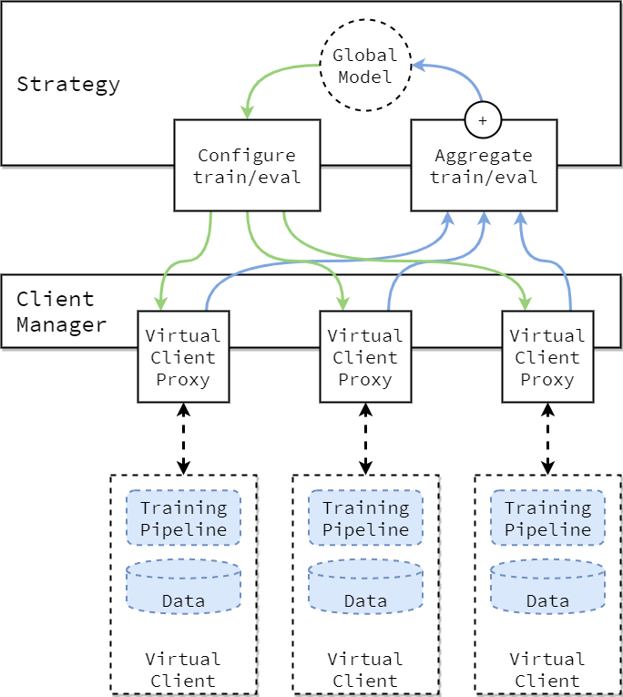

# Parallel Federated Learning Test Environment
Testing on the hypothesis that the server side idle time can be utilized for a better optimization.
While there are some research on PFL(Parallel Federated Learning), which has parallel servers that run concurrently to achieve
a faster convergence rate.

This research however, looks towards the inner workings of the basic federated learning architecture and focuses on the idle
server times. The idleness of the servers comes from the time during each clients training and evalaution epochs. Thus, in order to maxmize the
server aggregations we propose a _PWFL_, a Parallel Weight Federated Learning, novel approach to the any counterpart, as the server
recognizes multiple weights and global model running on different model running concurrently. Given that many research can be done
on a cross-silo setting(where the central servers have enough computing power), we can validate that this parallel can be achieved

During each global round, the PWFL server can initiate two or more weight parameters.
Considering the environment of K clients, we can divide the weights to 2 different subsets. S which would be chosen at random, and S' wich will be the complementary clients of whole subset.
This will ensure that no clients recieve 2 weights at the same time, and the concurrency will be saved.

### Flower Architecture

For the experiments we are building off the adap/flwr library, especially the
python sdk environment. 

### Current Outtakes
10.21.23
Comparing the pServer and the Server, as of now the servers are running sequentially, thus the process is about twice the amount from
the orginal server.

- [ ] Use thread to concurrently run the weights
- [ ] Need to configure how to select the clients for the weights, creating a subset
- [ ] Create a wrapper class for the weights, so more than two can be implemented
10.27.23
The Problem seems to be client modules and others not being able to imported by the future workers in the process 

## Research Proposal 11/09/23
[Research Proposal Takumi Sudo: View on canvas](https://app.eraser.io/workspace/vvNaQPP5WrZE52aa4gdQ) 

<!--- Eraser file: https://app.eraser.io/workspace/I6cZQSI0T1GLRu3oYoJp --->
